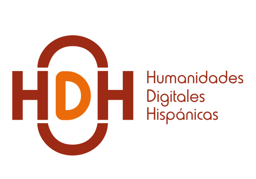
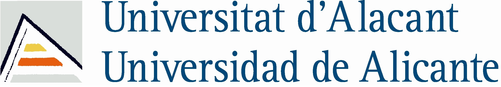

# hdh-cafe-con-2023
Proyecto para actividad HDH "Café con" con la Asociación de Humanidades Digitales Hispánicas

## Introducción

Este proyecto se presentará en la actividad [Café con](https://humanidadesdigitaleshispanicas.es/cafe-con-gustavo-candela-4-de-abril-de-2023/) a modo de ejemplo del trabajo realizado sobre [colecciones como datos](https://collectionsasdata.github.io/) en el proyecto [BVMC Labs](https://data.cervantesvirtual.com) de la [Biblioteca Virtual Miguel de Cervantes](https://www.cervantesvirtual.com).

## Licencia y términos de uso

 This work is licensed under a <a rel="license" href="http://creativecommons.org/licenses/by/3.0/">Creative Commons Attribution 3.0 Unported License</a>.

## Referencias

- [Collections as Data](https://collectionsasdata.github.io/)
- [International GLAM Labs Community](https://glamlabs.io/)
- [Impact Centre of Competence](https://www.digitisation.eu/)
