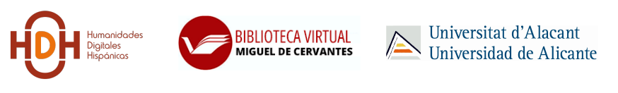
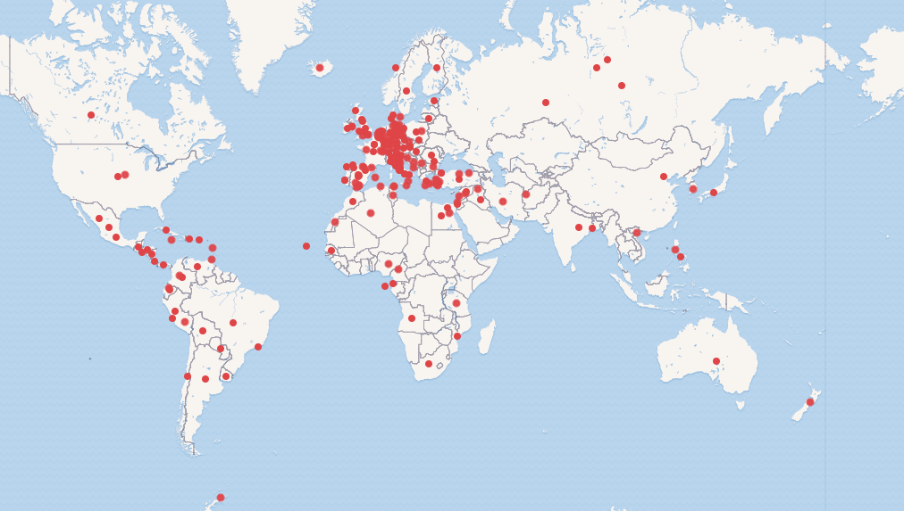
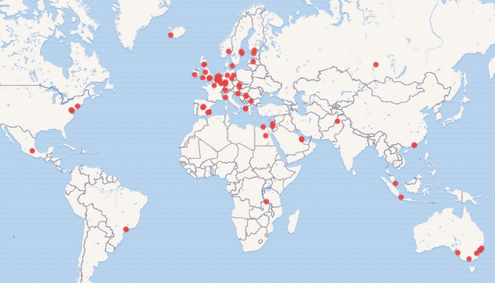
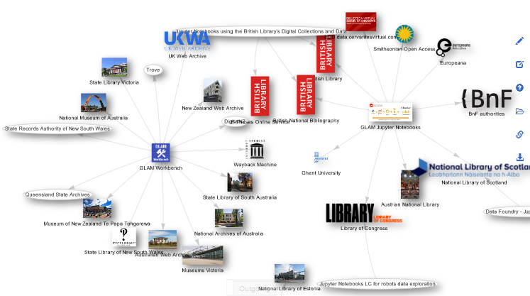

# Compartir Pantalla: Linked Open Data y SPARQL
Proyecto presentado en la actividad ["Compartir pantalla"](https://humanidadesdigitaleshispanicas.es/compartir-pantalla-con-gustavo-candela-14-de-noviembre-de-2023/) con la [Asociación de Humanidades Digitales Hispánicas](https://humanidadesdigitaleshispanicas.es/).

[](https://mybinder.org/v2/gh/hibernator11/hdh-cafe-con-2023/HEAD)

[](https://zenodo.org/badge/latestdoi/620414822)



## Introducción

Este proyecto forma parte de la actividad "Compartir pantalla" que introduce Wikidata en el ámbito bibliotecario como plataforma para facilitar el acceso, enriquecimiento y la visibilidad a través de la edición de recursos y el uso de SPARQL para recuperar información en forma de datos y recursos gráficos.

Además, se incluyen ejemplos de sentencias SPARQL proporcionados por Wikidata introduciendo los diferentes comandos e instrucciones, visualizaciones reales utilizadas en la web de [Biblioteca Virtual Miguel de Cervantes](https://data.cervantesvirtual.com/datos-enlazados) y la [International GLAM Labs Community](https://glamlabs.io), y otros ejemplos ilustrativos como por ejemplo sentencias federadas y creación de datasets.


## Datos abiertos y enlazados

La Biblioteca Virtual Miguel de Cervantes publicó su catálogo de metadatos como [datos abiertos y enlazados](https://data.cervantesvirtual.com/datos-enlazados) (en inglés, Linked Open Data) utilizando como vocabulario principal [Resource, Description and Access](http://www.rdaregistry.info/). El repositorio se ha enriquecido con [Wikidata](https://www.wikidata.org) a través de diferentes propiedades creadas con el objetivo de enlazar [autores](https://www.wikidata.org/wiki/Property:P2799) y [obras](https://www.wikidata.org/wiki/Property:P3976).

Gracias al enriquecimiento, existe la posibilidad de explorar nuevas formas de acceso al catálogo por medio de nuevas propiedades proporcionadas por Wikidata (p. ej. nacionalidad o movimiento del autor) o visualizaciones basadas en el uso de gráficas y mapas.


## Representación de las nacionalidades de los autores
El siguiente ejemplo muestra las nacionalidades de los autores de Wikidata enlazados a la Biblioteca Virtual Miguel de Cervantes. En este [enlace](https://w.wiki/6WRC) se puede ejecutar la siguiente sentencia SPARQL en el editor de consultas de Wikidata.

```
#defaultView:Map
SELECT DISTINCT ?autor ?autorLabel (SAMPLE(?imagen) as ?img) (SAMPLE(?coordenadas) as ?co)
WHERE {   
       ?autor wdt:P2799 ?idbvmc.
       ?autor wdt:P27 ?pais .
       OPTIONAL {?pais wdt:P625 ?coordenadas.}
       OPTIONAL {?autor wdt:P18 ?imagen .}      
    SERVICE wikibase:label { bd:serviceParam wikibase:language "es" }
} GROUP BY ?autor ?autorLabel
```



## Miembros de la International GLAM Labs Community
La International GLAM Labs Community cuenta con un listado de miembros que se puede consultar en forma de mapa en su [web](https://glamlabs.io/member-map/). Cada miembro dispone de una entrada en Wikidata que contiene una propiedad ["miembro de"](https://www.wikidata.org/wiki/Property:P463) y con valor el identificador de la International GLAM Labs Community [Q72936141](https://www.wikidata.org/wiki/Q72936141). De esta forma podemos obtener como resultado de una sentencia SPARQL un mapa representando a sus miembros.

```
#defaultView:Map
SELECT distinct (SAMPLE(?image) as ?imageu) (SAMPLE(?logo) as ?logou) ?glamlabLabel (SAMPLE(?provinceLabel) as ?prov)  (SAMPLE(?website) as ?websiteu)
(SAMPLE(?location) as ?locationu) ?glamlab
WHERE {   
       ?glamlab wdt:P463 wd:Q72936141. 
        OPTIONAL {?glamlab wdt:P625 ?location.} # coordinates     
        OPTIONAL {?glamlab wdt:P159 ?headquarters. ?headquarters wdt:P625 ?location.}
        OPTIONAL {?glamlab wdt:P131 ?province.}     
        OPTIONAL {?glamlab wdt:P18 ?image .}      
        OPTIONAL {?glamlab wdt:P154 ?logo .}      
        OPTIONAL {?glamlab wdt:P856 ?website .}  
          
    SERVICE wikibase:label { bd:serviceParam wikibase:language "en" }
} GROUP BY ?glamlab ?glamlabLabel
```



## Proyectos basados en Jupyter Notebooks en instituciones GLAM
Las instituciones GLAM han comenzado a utilizar Jupyter Notebooks para reutilizar y documentar el uso de sus colecciones digitales que permiten el acceso computacional. Recientemente, la International GLAM Labs Community creó una nueva sección para este tipo de proyectos que se encuentra disponible en https://glamlabs.io/computational-access-to-digital-collections/. Para cada uno de ellos se creó una instancia en Wikidata enlazando a las colecciones digitales que utiliza. Consultar el [siguiente enlace](https://doi.org/10.1002/asi.24835) para más información.

```
#defaultView:Graph
SELECT ?nbs ?nbsLabel ?nbspic ?linkTo ?linkToLabel ?linknb ?pic
WHERE
{
  values ?nbs {wd:Q111396450 wd:Q111396660 wd:Q111411199 wd:Q111421153 wd:Q111421205 wd:Q111450546}
  ?nbs wdt:P2283 ?linkTo .
  ?linkTo wdt:P856 ?linknb .
  OPTIONAL {?nbs wdt:P154 ?nbspic .}
  OPTIONAL {?linkTo wdt:P127 ?owner. ?owner wdt:P154 ?pic .}
  OPTIONAL {?linkTo wdt:P126 ?manteiner. ?manteiner wdt:P154 ?pic .}
  OPTIONAL {?linkTo wdt:P154 ?pic .}
  OPTIONAL {?linkTo wdt:P18 ?pic .} 
  SERVICE wikibase:label {bd:serviceParam wikibase:language "en,fr,es" }
}
```



## National Library of Scotland
En colaboración con la National Library of Scotland y en el marco del proyecto [National Librarian’s Research Fellowship in Digital Scholarship 2022-23](https://github.com/NLS-Digital-Scholarship/nls-fellowship-2022-23), se transformaron varias colecciones digitales a la Web Semántica utilizando vocabularios como [schema.org](https://schema.org/) y [BIBFRAME](https://www.loc.gov/bibframe/).

Los recursos de la colección [Movie Image Archive](https://data.nls.uk/data/metadata-collections/moving-image-archive/) se enriquecieron con Wikidata con el objetivo de crear enlaces a localizaciones proporcionados por los metadatos originales que mayoritariamente nombraban localizaciones en Escocia. La sentencia se puede ejecutar en el siguiente [enlace](https://w.wiki/5qa4).

```
#defaultView:Map
PREFIX wd: <http://www.wikidata.org/entity/>
SELECT ?r ?rLabel (SAMPLE(?image) as ?img) (SAMPLE(?location) as ?l)
WHERE {   
  VALUES ?r {wd:Q793283 wd:Q207257 wd:Q211091 wd:Q980084 wd:Q17582129 wd:Q1247435 wd:Q652539 wd:Q2421 wd:Q23436 wd:Q1061313 wd:Q189912 wd:Q530296 wd:Q81052 wd:Q202177 wd:Q54809 wd:Q786649 wd:Q664892 wd:Q1247396 wd:Q1147435 wd:Q9177476 wd:Q47134 wd:Q3643362 wd:Q4093 wd:Q206934 wd:Q550606 wd:Q864668 wd:Q100166 wd:Q123709 wd:Q203000 wd:Q80967 wd:Q978599 wd:Q204940 wd:Q182923 wd:Q207268 wd:Q1229763 wd:Q376914 wd:Q106652 wd:Q36405 wd:Q201149 wd:Q1247384  }.

       ?r wdt:P625 ?location. # coordinates
       OPTIONAL {?r wdt:P18 ?image}.
          
    SERVICE wikibase:label { bd:serviceParam wikibase:language "en" }
} GROUP BY ?r ?rLabel ?img
```


## Consultas federadas
Las consultas federadas permiten acceder a otros repositorios de datos para recuperar y filtrar información. Por ejemplo, el repositorio de datos abiertos y enlazados de la [Biblioteca Virtual Miguel de Cervantes está federado con Wikidata](https://www.wikidata.org/wiki/Wikidata:SPARQL_query_service/Federation_report). Esto significa que desde Wikidata y a través del lenguaje de consulta SPARQL, podemos acceder al repositorio de la BVMC. Por ejemplo, podríamos estar interesados en recuperar las obras en la BVMC a partir de un autor de Wikidata. También, nos podría interesar recuperar las obras de autores que han nacido en un país particular. A continuación, se incluyen varios ejemplos.

```
SELECT ?workLabel WHERE {
  wd:Q165257 wdt:P2799 ?id 
  BIND(uri(concat("https://data.cervantesvirtual.com/person/", ?id)) as ?bvmcID) 
  SERVICE <http://data.cervantesvirtual.com/openrdf-sesame/repositories/data> {
    ?bvmcID <http://rdaregistry.info/Elements/a/authorOf> ?work .
    ?work rdfs:label ?workLabel        
  }
}
```
[Obras de Lope de Vega (wd:Q165257)](https://w.wiki/7Yvu)


```
SELECT ?autor ?work ?workLabel WHERE {
  ?autor wdt:P2799 ?id.
  ?autor wdt:P19 wd:Q11959
  BIND(uri(concat("https://data.cervantesvirtual.com/person/", ?id)) as ?bvmcID) 
  SERVICE <http://data.cervantesvirtual.com/openrdf-sesame/repositories/data> {
    ?bvmcID <http://rdaregistry.info/Elements/a/authorOf> ?work .
    ?work rdfs:label ?workLabel        
  }
}Limit 100
```

[Obras de la BVMC publicadas por autores nacidos en Alicante (wd:Q11959)](https://w.wiki/7Yvp)

## Propiedades que enlazan a repositorios de datos (GLAM) en Wikidata

Las propiedades que enlazan a organizaciones GLAM tienen asciada la propiedad wdt:P31 (instancia_de) con valor wd:Q21745557. De esta forma podemos recuperar los tipos de entidades en Wikidata de los recursos que tienen asociada esta propiedad.

```
SELECT distinct ?type ?typeLabel
WHERE {
    ?org wdt:P31 ?type .
    ?org wdt:P1687 ?property . ?property wdt:P31 wd:Q21745557
    SERVICE wikibase:label { bd:serviceParam wikibase:language "[AUTO_LANGUAGE],en". }
} LIMIT 20
```

[Tipos de entidades](https://w.wiki/7eq4)


A continuación, seleccionamos los valores de los tipos que queramos incluir en nuestra sentencia:

```
SELECT *
WHERE {
    VALUES ?type {wd:Q7075 wd:Q166118 wd:Q1007870 wd:Q33506 wd:Q212805 wd:Q207694 wd:Q856638 wd:Q1789476}.
    ?org wdt:P31 ?type .
    ?org wdt:P1687 ?property .
} LIMIT 1000
```
[Propiedades](https://w.wiki/7eq9)


## Información adicional

- Candela, G. Towards a semantic approach in GLAM Labs: The case of the Data Foundry at the National Library of Scotland. Journal of Information Science. Just Accepted (2023). https://doi.org/10.1177/01655515231174386
- Candela, G. An automatic data quality approach to assess semantic data from cultural heritage institutions. J. Assoc. Inf. Sci. Technol. 74(7): 866-878 (2023). https://doi.org/10.1002/asi.24761
- Candela, G., Pereda, J., Sáez, D., Escobar, P. Sánchez, A., Villa-Torres, A., Palacios, A., McDonough, K. y Murrieta-Flores, P. 2023. An ontological approach for unlocking the Colonial Archive. J. Comput. Cult. Herit. Just Accepted (April 2023). https://doi.org/10.1145/3594727
- Chambers, S. et al. (2023). Position Statements -> Collections as Data: State of the field and future directions (Version 1). Zenodo. https://doi.org/10.5281/zenodo.7897735
- Candela, G., Chambers,S., & Sherratt, T. (2023). An approach to assess the quality of Jupyter projects published by GLAM institutions. Journal of the Association for Information Science and Technology, 1–15. https://doi.org/10.1002/asi.24835
- [BVMC Labs](https://data.cervantesvirtual.com)
- [Collections as Data](https://collectionsasdata.github.io/)
- [International GLAM Labs Community](https://glamlabs.io/)
- [Impact Centre of Competence](https://www.digitisation.eu/)
- [GLAM Workbench](https://glam-workbench.net/)

## Licencia y términos de uso

<a rel="license" href="http://creativecommons.org/licenses/by/4.0/"></a><br />Esta obra está bajo una <a rel="license" href="http://creativecommons.org/licenses/by/4.0/">Licencia Creative Commons Atribución 4.0 Internacional</a>.

## Agradecimientos
Este proyecto es el resultado de varios años de trabajo en el marco de la [Biblioteca Virtual Miguel de Cervantes](https://www.cervantesvirtual.com/), en colaboración con la [International GLAM Labs Community](https://glamlabs.io), [Impact Centre of Competence](https://www.digitisation.eu/), la [Biblioteca Nacional de Escocia](https://data.nls.uk/projects/the-national-librarians-research-fellowship-in-digital-scholarship-2022-23/), la [Universidad de Lancaster](https://unlockingarchives.com), [Wikimedia España](https://www.wikimedia.es/), Wikimedia UK y numerosos investigadores internacionales de diferentes instituciones de patrimonio cultural y académico.


